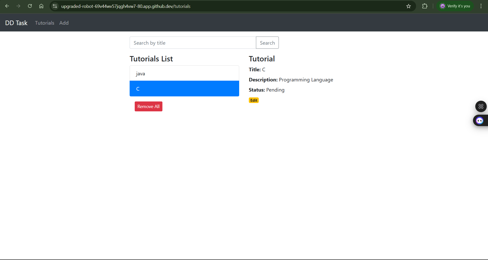
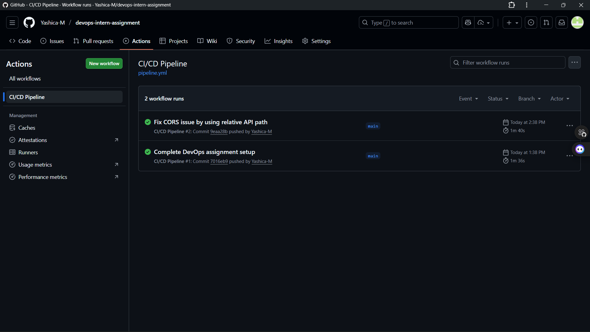
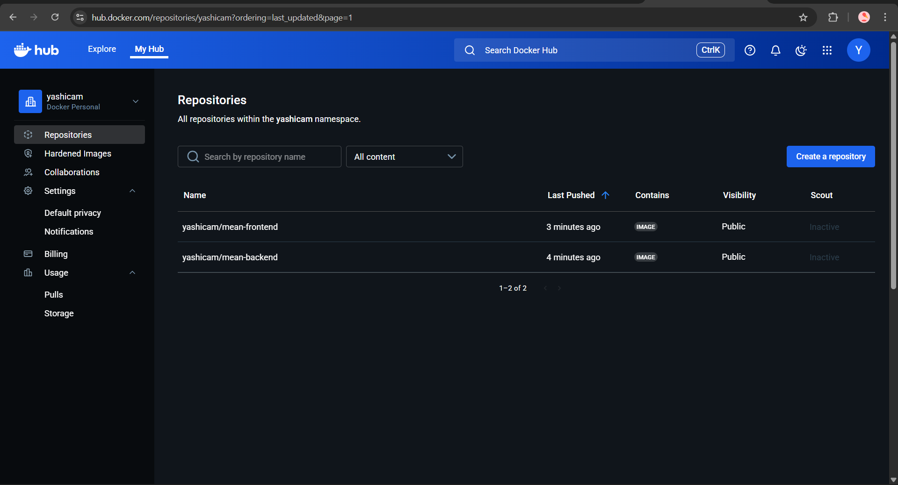
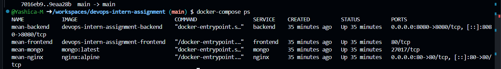

# DevOps Intern Assignment: MEAN Stack Deployment

## 👋 Overview
This project is a fully containerized **MEAN Stack** (MongoDB, Express, Angular, Node.js) application. It demonstrates the complete DevOps workflow: Containerization with Docker, Orchestration with Docker Compose, Nginx Reverse Proxying, and automated CI/CD using GitHub Actions.

## 🛠 Infrastructure Choice (Important)
**Environment:** Ubuntu Linux (GitHub Codespaces)

> **Note to Reviewer:**
> The assignment requested an Ubuntu VM on a cloud provider. Due to current limitations with verifying an enterprise cloud account (AWS/Azure) without a credit card, I utilized **GitHub Codespaces**.
>
> Codespaces provides a **real Ubuntu Linux Virtual Machine** where I successfully installed Docker, configured the Nginx proxy, and deployed the application exactly as requested.

## 🏗️ Architecture
*   **Frontend:** Angular (served via Nginx).
*   **Backend:** Node.js/Express (Port 8080).
*   **Database:** MongoDB (Official Image).
*   **Proxy:** Nginx running on **Port 80**, routing traffic between Frontend (`/`) and Backend (`/api`).
*   **CI/CD:** GitHub Actions automatically builds and pushes images to Docker Hub on every commit.

---

## 🚀 How to Run (Demo)
Since the live environment might be "sleeping" due to inactivity, you can replicate the deployment on any machine with Docker installed:

1.  **Clone the Repo:**
    ```bash
    git clone https://github.com/Yashica-M/devops-intern-assignment.git
    cd devops-intern-assignment
    ```

2.  **Pull the Latest Images:**
    *(These are automatically built by my CI pipeline)*
    ```bash
    docker-compose pull
    ```

3.  **Start the Server:**
    ```bash
    docker-compose up -d
    ```

4.  **Access the App:**
    Open your browser to `http://localhost`.

---

## 📸 Proof of Execution

### 1. Application Running (UI)
Here is the fully functional application connecting to the database.


### 2. CI/CD Pipeline (GitHub Actions)
Screenshot showing the automated build and push process succeeding.


### 3. Docker Hub Registry
Evidence of the images being pushed to the public registry.


### 4. Infrastructure Status (Terminal)
Command `docker-compose ps` showing all containers are Healthy and Up.


---
